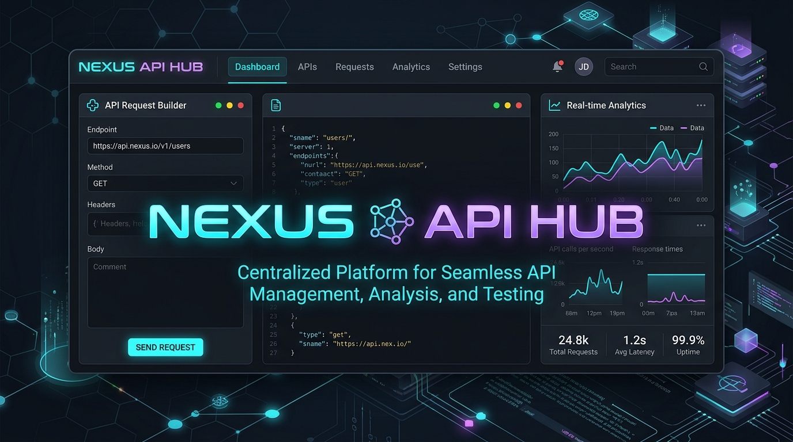

<div align="center">

  

  # 🌐 NEXUS API HUB 🌐
  ### *Real-Time API Playground, Mock Server Studio & Performance Analytics*

  [](LICENSE)
  [](https://developer.mozilla.org/en-US/docs/Web/JavaScript)
  [](#)
  [](#)

</div>

---

## 🚀 Overview

**NEXUS API HUB** is an open-source, lightweight, zero-dependency REST API playground, mock server studio, and real-time network analytics dashboard.

Whether you're testing external APIs, crafting mock endpoints for front-end prototyping, or analyzing live API latency metrics, NEXUS API HUB gives developers a streamlined Postman-like experience straight in the browser.

---

## 🔥 Key Features

- ⚡ **Interactive API Playground**: Support for `GET`, `POST`, `PUT`, `DELETE`, and `PATCH` requests with custom URL params, headers, and JSON body payload editor.
- 🛠️ **Built-in Mock Server Studio**: Create custom mock endpoints (`/api/v1/users`, `/api/v1/login`, etc.) with customizable HTTP status codes (200, 201, 400, 404, 500), simulated network delay (ms), and custom JSON payloads.
- 📊 **Real-Time Latency & Health Analytics**: Live HTML5 Canvas latency line graph, total request counters, success rate percentages, and automated health checks for public APIs.
- 💻 **Instant Code Generator**: Automatically generates production-ready code snippets in **cURL**, **JavaScript (`fetch`)**, **Python (`requests`)**, and **Go**.
- 📋 **Response Inspector**: Formatted JSON code viewer, HTTP status badge (2xx/4xx/5xx), execution duration timer, payload byte size counter, and 1-click clipboard copy.
- 💾 **Local Persistence**: Save custom mock endpoints and request history in browser `localStorage`.

---

## 🕹️ Quick Start / How to Run Locally

NEXUS API HUB requires zero build steps or package managers.

### Option 1: Python Server
```bash
# Clone the repository
git clone https://github.com/DHIRAJ-GHOLAP/nexus-api-hub.git
cd nexus-api-hub

# Start local server
python3 -m http.server 8080
```
Open your browser at `http://localhost:8080`.

### Option 2: Node.js npx
```bash
npx serve .
```

---

## 📦 Deploy to GitHub Pages

1. Create a repository named `nexus-api-hub` on GitHub.
2. Initialize git and push:
```bash
cd nexus-api-hub
git init
git add .
git commit -m "Initial commit: NEXUS API HUB Platform"
git branch -M main
git remote add origin https://github.com/YOUR_USERNAME/nexus-api-hub.git
git push -u origin main
```
3. Enable GitHub Pages in **Repository Settings -> Pages -> Branch: main -> Save**.

---

## 📄 License

Distributed under the MIT License. See [`LICENSE`](LICENSE) for details.
